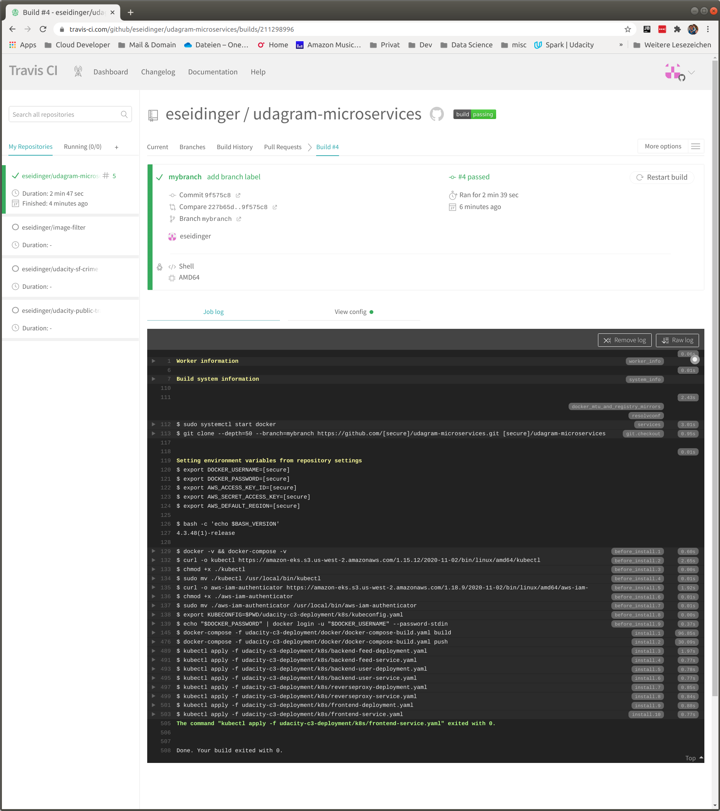
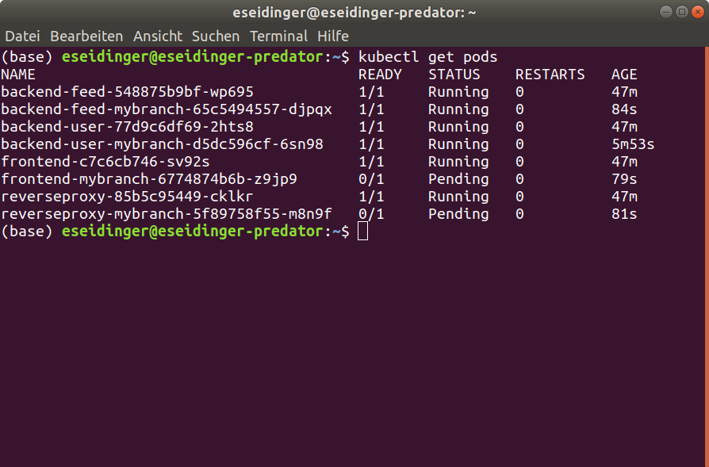
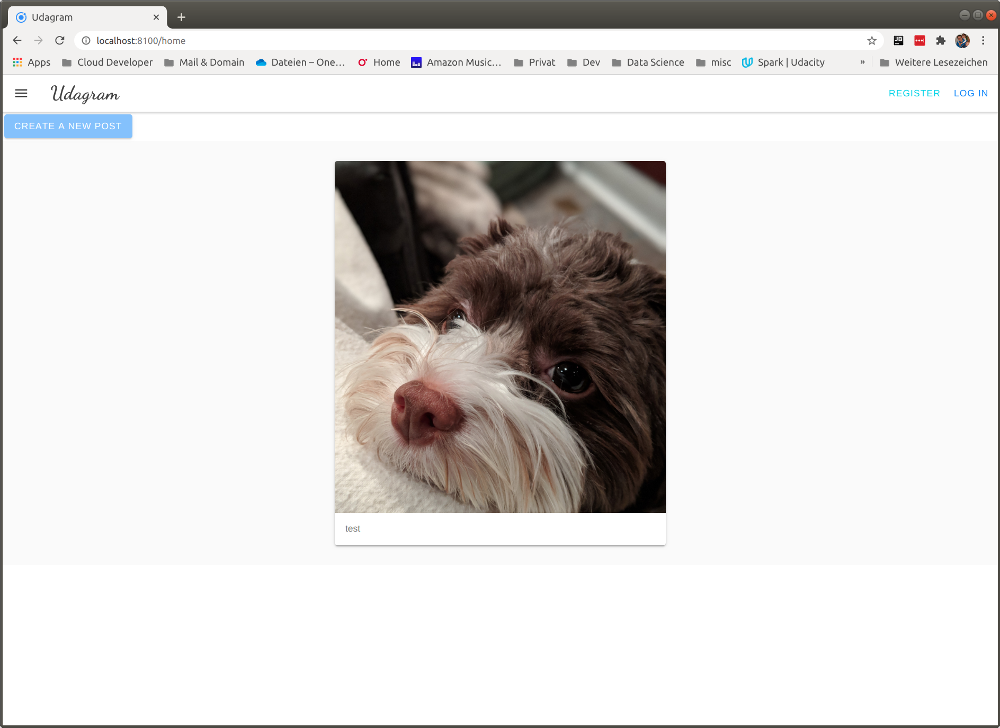

# Udagram Microservices on EKS

## Resources

### Links

https://github.com/eseidinger/udagram-microservices

https://hub.docker.com/repository/docker/eseidinger/udacity-frontend

https://hub.docker.com/repository/docker/eseidinger/udacity-restapi-feed

https://hub.docker.com/repository/docker/eseidinger/udacity-restapi-user

https://hub.docker.com/repository/docker/eseidinger/reverseproxy

### Screenshots of Travis CI




### Screenshot of Pods



### Screenshot of the Application



## Build and Deploy Docker Images

    docker-compose -f udacity-c3-deployment/docker/docker-compose-build.yaml build
    docker-compose -f udacity-c3-deployment/docker/docker-compose-build.yaml push

## Deploy to Kubernetes Cluster

    kubectl apply -f udacity-c3-deployment/k8s/backend-feed-deployment.yaml
    kubectl apply -f udacity-c3-deployment/k8s/backend-feed-service.yaml
    kubectl apply -f udacity-c3-deployment/k8s/backend-user-deployment.yaml
    kubectl apply -f udacity-c3-deployment/k8s/backend-user-service.yaml
    kubectl apply -f udacity-c3-deployment/k8s/reverseproxy-deployment.yaml
    kubectl apply -f udacity-c3-deployment/k8s/reverseproxy-service.yaml
    kubectl apply -f udacity-c3-deployment/k8s/frontend-deployment.yaml
    kubectl apply -f udacity-c3-deployment/k8s/frontend-service.yaml

## Upgrade

On _main_ branch:

* build and push new image versions to Docker Hub
* update image versions in deployment YAML files
* deploy to kubernetes cluster

Building and deploying can be done via Travis CI by simply pushing _main_ to GitHub.

### Rollback

* downgrade image versions in deployment YAML files
* deploy to kubernetes cluster

## A/B Deployment

On branch _mybranch_ deployments have suffix _-mybranch_:

* build and push a new image versions to Docker Hub
* update image versions in deployment YAML files
* deploy to kubernetes cluster

Building and deploying can also be done via Travis CI by simply pushing _mybranch_ to GitHub.

### Rollback

Delete the deployments containing the suffix _-mybranch_

# Udagram Image Filtering Microservice

Udagram is a simple cloud application developed alongside the Udacity Cloud Engineering Nanodegree. It allows users to register and log into a web client, post photos to the feed, and process photos using an image filtering microservice.

The project is split into three parts:
1. [The Simple Frontend](/udacity-c3-frontend)
A basic Ionic client web application which consumes the RestAPI Backend. 
2. [The RestAPI Feed Backend](/udacity-c3-restapi-feed), a Node-Express feed microservice.
3. [The RestAPI User Backend](/udacity-c3-restapi-user), a Node-Express user microservice.

## Getting Setup

> _tip_: this frontend is designed to work with the RestAPI backends). It is recommended you stand up the backend first, test using Postman, and then the frontend should integrate.

### Installing Node and NPM
This project depends on Nodejs and Node Package Manager (NPM). Before continuing, you must download and install Node (NPM is included) from [https://nodejs.com/en/download](https://nodejs.org/en/download/).

### Installing Ionic Cli
The Ionic Command Line Interface is required to serve and build the frontend. Instructions for installing the CLI can be found in the [Ionic Framework Docs](https://ionicframework.com/docs/installation/cli).

### Installing project dependencies

This project uses NPM to manage software dependencies. NPM Relies on the package.json file located in the root of this repository. After cloning, open your terminal and run:
```bash
npm install
```
>_tip_: **npm i** is shorthand for **npm install**

### Setup Backend Node Environment
You'll need to create a new node server. Open a new terminal within the project directory and run:
1. Initialize a new project: `npm init`
2. Install express: `npm i express --save`
3. Install typescript dependencies: `npm i ts-node-dev tslint typescript  @types/bluebird @types/express @types/node --save-dev`
4. Look at the `package.json` file from the RestAPI repo and copy the `scripts` block into the auto-generated `package.json` in this project. This will allow you to use shorthand commands like `npm run dev`


### Configure The Backend Endpoint
Ionic uses enviornment files located in `./src/enviornments/enviornment.*.ts` to load configuration variables at runtime. By default `environment.ts` is used for development and `enviornment.prod.ts` is used for produciton. The `apiHost` variable should be set to your server url either locally or in the cloud.

***
### Running the Development Server
Ionic CLI provides an easy to use development server to run and autoreload the frontend. This allows you to make quick changes and see them in real time in your browser. To run the development server, open terminal and run:

```bash
ionic serve
```

### Building the Static Frontend Files
Ionic CLI can build the frontend into static HTML/CSS/JavaScript files. These files can be uploaded to a host to be consumed by users on the web. Build artifacts are located in `./www`. To build from source, open terminal and run:
```bash
ionic build
```
***